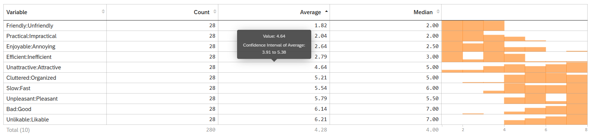
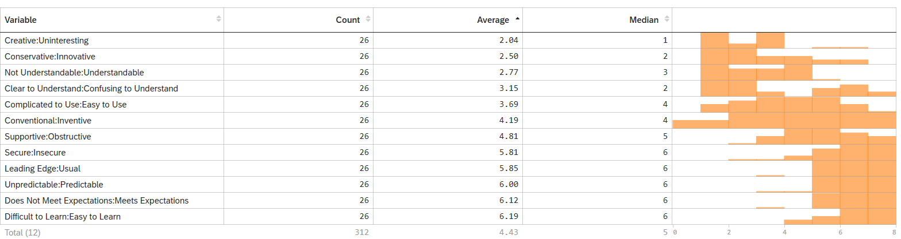

**Report on Extending ELIZA for Medical Symptom Checking**

**Introduction**
This project aimed to extend the classic ELIZA chatbot to handle specialized, context-aware natural language inputs related to medical symptom checking. By expanding ELIZA's rule-based architecture, I sought to simulate a basic medical triage chatbot capable of recognizing and responding to common medical symptoms while avoiding diagnostic claims. This report documents the challenges faced during development, the methodology for user testing, and the results of user interactions.

---

**Demo**

Please go to the recording included in the project under the name "Recording 2024-12-12 155507.mp4". The README should be plenty to set up and run this project but in the event you run into issues, I included a demo video.

---

**Implementation**

Initial implementation was very simple and used some source code from HW07 as a starter code. 

One significant challenge was determining how to facilitate user interaction for testing purposes. Initially, I planned to deploy the ELIZA bot using Quicklisp and the Hunchentoot library to create a web-based interface. This approach seemed promising as it would have allowed users to access the bot from their own devices over a local or hosted server.

However, during implementation, I encountered limitations with Hunchentoot. Specifically, I discovered that Hunchentoot lacks modern server and port functionality necessary for seamless deployment. Troubleshooting these issues consumed significant time and ultimately led me to abandon the web-based approach.

Instead, I opted to host the ELIZA bot locally on my machine and conducted testing by inviting users to interact with the bot directly. While this limited the scale of user testing, it provided a controlled environment to gather feedback and observe interactions.

---

**Initial Research**

When deciding this project, I wanted to know if this was something worth pursuing. I was not sure if AI screeners and chatbots were accurate or useful. I was happy to find out that they are regularly used now, especially after COVID-19. Even more exciting to learn was that medical practioners and patients liked to use the chatbots and found them helpful[[1]](https://www.mdpi.com/2075-4426/13/9/1379?ref=perpet.io).

Before constructing my bot, I decided to do some research into existing chatbots that serve as screeners and such. I was initially going to use SymCat but I am guessing something happened because whenever I tried to view their page, it said it was under maintenance. So I searched for another chatbot for an example. One such chatbot is [DoctronicAI](https://www.doctronic.ai/symptom-checker/?utm_source=google&utm_medium=cpc&utm_campaign=20502944555&utm_content=160124298699&utm_term=ai%20symptom%20checker&matchtype=b&gad_source=1&gclid=CjwKCAiAjeW6BhBAEiwAdKltMhLcKSsXf0F3DBQX-L0Rwd6uGlW8oQtOiJhZ43uDIjQeKkR2by2OlRoCjQYQAvD_BwE). I used this as a model for how I should create my bot.

What I had planned to do, was essentially allow the participant to guide the conversation but after exploring DoctronicAI and the resulting user feedback was that it is much better if the user initally guides the conversation but then the bot asks clarifying questions. For example this is what an initial conversation looked like:

```
ELIZA:HELLO
> I have a fever
ELIZA:I am sorry that you have a fever, what happened?
```

The next iteration of the eliza-bot asked more close-ended questions to minimize confusing ELIZA.

```
ELIZA: HELLO
> I have a fever
ELIZA: I am sorry that you have a fever, how long have you had this fever?
```

That still left me with what to do on how to simulate conversations and design responses from ELIZA. I didn't have access to DoctronicAI's database or their results so I ended up stuck for a few days on what to do. I ended up finding this [git repository](https://github.com/LiuQL2/MedicalChatbot/blob/develop/acl2018-mds.zip) that included some data sets I could use.

---

**Response Analysis**

For my response analysis, I created a set of user input's based on the data sets mentioned above. The user input is as follows:

```
I've been feeling really tired lately

I wake up feeling exhausted and it doesn't seem to get better as the day goes on

I have also had a cough too.

It is a dry cough and very persistent.

I also have a fever of 101F

I've had some shortness of breath but it is very mild

One of my coworkers was sick last week

```

My first iteration of ELIZA generated a conversation like this:

```
Welcome to ELIZA your new symptom-checker! If this is an emergency STOP and call 911
Please enter your age 18
Thank you! You entered age 18
Please enter your sex (male female or other)
female
Thank you! You entered sex female

ELIZA> I've been feeling really tired lately
I AM NOT SURE I UNDERSTAND YOU FULLY TRY USING KEYWORDS LIKE FEVER OR PAIN
ELIZA> I wake up feeling exhausted and it doesn't seem to get better as the day goes on
GIVE ME MORE DETAILS
ELIZA> I have also had a cough too
HOW LONG HAVE YOU BEEN COUGHING?
ELIZA> Several days
CAN YOU REPHRASE WHAT YOU ARE DESCRIBING IN ANOTHER WAY?
ELIZA> It is a dry cough and very persistent
HOW LONG HAVE YOU BEEN COUGHING?
ELIZA> I also have a fever of 101F
HAVE YOU HAD THIS FEVER FOR LONG?
ELIZA> Several days
GIVE ME MORE DETAILS
ELIZA> I've had some shortness of breath but it is very mild
ARE YOU EXPERIENCING DIFFICULTY BREATHING EVEN AT REST?
ELIZA> No
CAN YOU REPHRASE WHAT YOU ARE DESCRIBING IN ANOTHER WAY?
ELIZA> One of my coworkers was sick last week
I AM NOT SURE I UNDERSTAND YOU FULLY TRY USING KEYWORDS LIKE FEVER OR PAIN
```

Clearly there was some room for improvement. I decided to focus on improving two aspects at this point, handling descriptors like "mild" or "intense" and improving the clarifying questions that ELIZA asks. I also made it so ELIZA could handle answers like yes or no.

This is how the new iteration of ELIZA was handling responses:

```
Welcome to ELIZA your new symptom-checker! If this is an emergency STOP and call 911
Please enter your age 18
Thank you! You entered age 18
Please enter your sex (male female or other)
female
Thank you! You entered sex female

ELIZA> I've been feeling really tired lately
DO YOU FEEL TIRED EVEN AFTER RESTING?
ELIZA> Yes
THAT IS NOT GOOD. DO YOU HAVE ANY OTHER SYMPTOMS?
ELIZA> I wake up feeling exhausted and it doesn't seem to get better as the day goes on
HAVE YOU HAD ANY ISSUES SLEEPING?
ELIZA> no
THAT IS A GOOD SIGN AT LEAST! PLEASE TELL ME ABOUT ANY OTHER SYMPTOMS YOU HAVE!
ELIZA> I have also had a cough too
HOW LONG HAVE YOU BEEN COUGHING?
ELIZA> 3 days
IF IT HAS BEEN LONGER THAN 3 DAYS YOU SHOULD GO TO THE INSTACARE AS SOON AS POSSIBLE. OTHERWISE WAIT UNTIL YOUR SYMPTOMS CHANGE.
ELIZA> I also have a fever of 101F
DO YOU FEEL ANY CHILLS OR SWEATING?
ELIZA> yes
THAT IS NOT GOOD. DO YOU HAVE ANY OTHER SYMPTOMS?
ELIZA> I've had some shortness of breath but it is very mild
WHEN DID YOU FIRST NOTICE SHORTNESS OF BREATH?
ELIZA> 2 days ago
IF IT HAS BEEN LONGER THAN 3 DAYS YOU SHOULD GO TO THE INSTACARE AS SOON AS POSSIBLE. OTHERWISE WAIT UNTIL YOUR SYMPTOMS CHANGE.
```

I really wanted to be able to have ELIZA store information about the user but I was quickly running out of time if I wanted to have user feedback.

I will talk more in detail about what user feedback I received in my survey in another section but here is an example of the feedback implemented.

**Introduction**
This project aimed to extend the classic ELIZA chatbot to handle specialized, context-aware natural language inputs related to medical symptom checking. By expanding ELIZA's rule-based architecture, I sought to simulate a basic medical triage chatbot capable of recognizing and responding to common medical symptoms while avoiding diagnostic claims. This report documents the challenges faced during development, the methodology for user testing, and the results of user interactions.

---

```
Welcome to ELIZA your new symptom-checker! If this is an emergency STOP and call 911
Please enter your age 12
Thank you! You entered age 12
Please enter your sex (male female or other)
female
Thank you! You entered sex female

ELIZA> I've been feeling really tired lately
DO YOU FEEL TIRED EVEN AFTER RESTING?
ELIZA> yes
CONSIDER GOING TO THE DOCTOR AS YOUR SYMPTOMS ARE INDICATION OF SOMETHING WRONG
ELIZA> I have also had a cough too
IS YOUR COUGH DRY OR WET?
ELIZA> dry
A DRY COUGH CAN BE AN INDICATION OF COVID-19 OR ANOTHER SUCH VIRUS.
ELIZA> I also have a fever
DO YOU FEEL ANY CHILLS OR SWEATING?
ELIZA> yes
THAT IS NOT GOOD. DO YOU HAVE ANY OTHER SYMPTOMS?
ELIZA> I've had some shortness of breath
WHEN DID YOU FIRST NOTICE SHORTNESS OF BREATH?
ELIZA> 2 days ago
IF IT HAS BEEN LONGER THAN 3 DAYS YOU SHOULD GO TO THE INSTACARE AS SOON AS POSSIBLE. OTHERWISE WAIT UNTIL YOUR SYMPTOMS CHANGE.
ELIZA> One of my coworkers was sick last week
IF ONE OF YOUR COWORKERS WAS SICK LAST WEEK THEN YOU MAY HAVE CAUGHT WHATEVER THEY HAD.
ELIZA> bye
TAKE CARE. STAY HEALTHY! IF YOU HAVE TIME PLEASE FILL OUT THIS SURVEY https://usu.co1.qualtrics.com/jfe/form/SV_5mu22ytm9CQYpSu
```

---

**User Survey Methodology**

Given the local setup, I devised a straightforward survey to collect user feedback. After interacting with the ELIZA bot, users were asked to answer the following questions:

1. How was your experience with the ELIZA bot?
2. How would you rate the ELIZA bot?
3. What improvements would you suggest?

Users' answers were recorded via a qualtrics survey.

---

**Survey Results**

The results for question 1 are displayed below:



The results for question 2 are displayed below:



This shows that my bot has room for improvement in several areas. Even though my bot has a simple design, I scored surprisingly high on attractiveness and organization. I do think that with CLISP's limitations there was very little I could do to improve this anyways but I was pleasantly surprised by the results. I was surprised at the fact that even though my implementation was very simple, people were very impressed at how well it performed.

---

**User Feedback**

Overall user feedback was positive and people seemed impressed at the little bot, but they did provide me with lots of good ideas which are summarized into 4 themes below.

- "Many users appreciated the simplicity of the interaction but felt the bot could provide more detailed follow-up questions."
- "Some users reported that the bot's responses felt repetitive or overly generic for certain symptoms."
- "A common suggestion was to improve the error handling of ELIZA"
- "Include a survey mechanism at the end to develop feedback to improve use."

---

**Features Implemented**

- **Symptom Recognition**: ELIZA was updated to identify and respond to a predefined set of symptoms, including fever and cough.
  - I originally was going to do this for many different symptoms but only had enough time to craft really good recognition of cough and fever. See response analysis for a detailed example of improvements.
- **Contextual Responses**: New patterns were added to generate symptom-specific responses, providing users with relevant guidance or follow-up prompts.
  - See response analysis for an example.
- **Error Handling**: Enhanced rules to address unrecognized inputs and guide users toward clarifying their queries.
  - I changed the answers to redirect the user in a very clear way and gave a "help" response in case a user needed help navigating ELIZA.
- **Survey Mechanism**: A local user survey mechanism was developed to capture feedback directly after interactions.
  - I implemented this by including the qualtrics link in one of the responses when the user says good-bye to ELIZA. I only wanted it in one response because I don't want this to feel like an advertisement.

---

**Future Improvements**

If I had more time and more manpower and resources I would implement the following changes.

* Develop a backend to store the data collected
* Find some way to deploy it as a web-based application
* Continue expanding ELIZA's vocabulary to include more nuanced language like sharp, numb and tingling.

---

**Conclusion**
Despite the initial setbacks with deploying ELIZA as a web-based application, the project successfully extended the chatbot's capabilities to handle medical symptom-related dialogues. User testing provided valuable insights into areas for improvement, such as expanding the bot's vocabulary and refining response specificity. These findings will inform future iterations of the bot.

This project aimed to extend the classic ELIZA chatbot to handle specialized, context-aware natural language inputs related to medical symptom checking. By expanding ELIZA's rule-based architecture, I sought to simulate a basic medical triage chatbot capable of recognizing and responding to common medical symptoms while avoiding diagnostic claims. This report documents the challenges faced during development, the methodology for user testing, and the results of user interactions.
